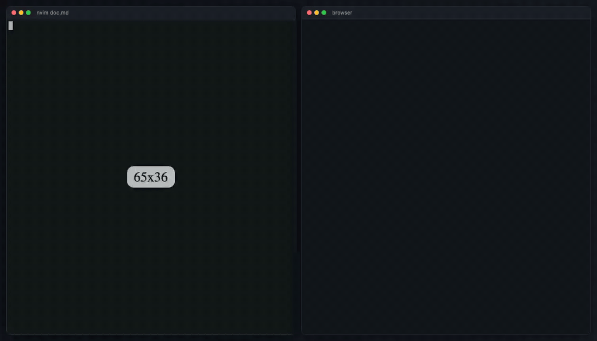

# markdown-preview.nvim

Live markdown preview in your browser, powered by [Bun](https://bun.sh). Save the buffer and the page reloads instantly via server-sent events — no polling, no heavyweight dependencies.



## Features

- **Live reload on save** — server-sent events push updates to the browser the moment you `:w`
- **GitHub-flavored markdown** rendered with [marked](https://github.com/markedjs/marked)
- **Syntax highlighting** for fenced code blocks via highlight.js
- **Light/dark theme** with a toggle, following your system preference by default
- **Heading anchors** — `#some-section` links work like on GitHub
- **Vim-style navigation** — `j`/`k`/`h`/`l` scroll, `gg`/`G` jump to top/bottom, `Ctrl-d`/`Ctrl-u` half-page
- **Live search** — `Ctrl-k` (or `/`) opens a search modal that highlights matches as you type; navigate with `↑`/`↓`, jump with `↵`, close with `esc`
- **Local assets** — relative images and files resolve against the markdown file's directory
- **Localhost only** — the server binds to `127.0.0.1` on a random free port

## Requirements

- Neovim >= 0.10
- [bun](https://bun.sh) on your `$PATH`
- `curl` (used to trigger reloads on save)

## Installation

With [lazy.nvim](https://github.com/folke/lazy.nvim):

```lua
{
    "trebaud/markdown-preview.nvim",
    ft = "markdown",
    keys = {
        { "<leader>mp", "<cmd>MarkdownPreview<CR>", ft = "markdown", desc = "Markdown: browser preview" },
    },
}
```

No `setup()` call is required. Server dependencies are installed automatically (one `bun install`) the first time you run the preview.

## Usage

| Command                 | Description                                  |
| ----------------------- | -------------------------------------------- |
| `:MarkdownPreview`      | Start the server and open the preview        |
| `:MarkdownPreviewStop`  | Stop the preview server                      |

The server is also stopped automatically when you quit Neovim.

Run `:checkhealth markdown-preview` to verify your setup.

## How it works

`:MarkdownPreview` spawns a small Bun server (`bun/server.ts`) for the current file and opens it in your default browser. On every save, Neovim pings the server, which re-renders the file and notifies connected browsers over an SSE stream.

## License

[MIT](LICENSE)
